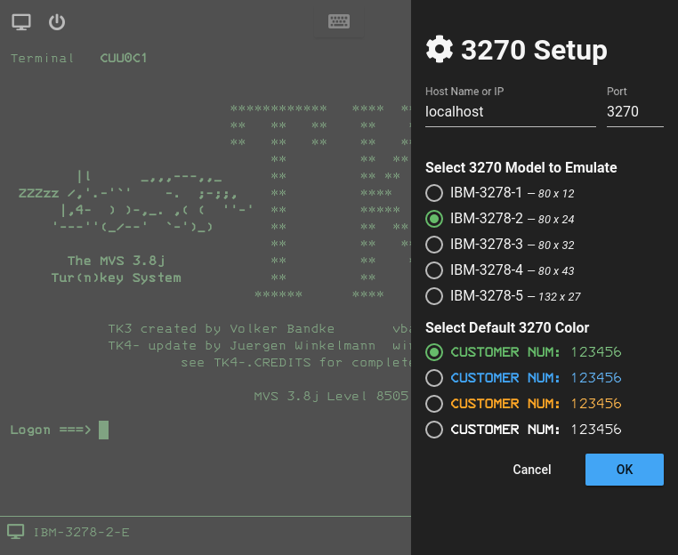
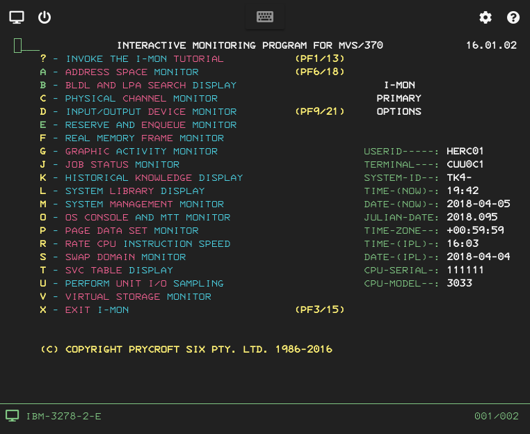
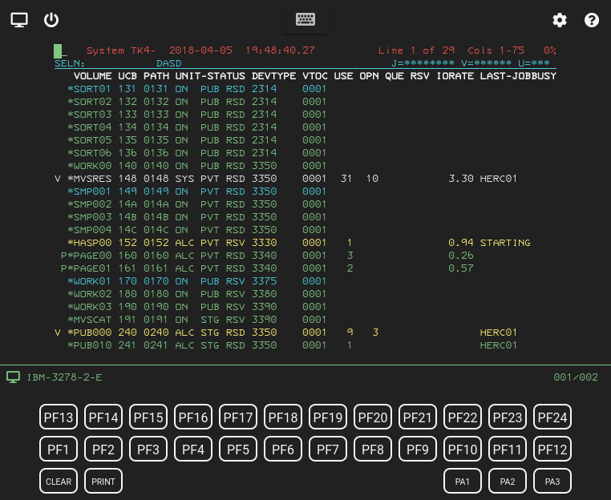
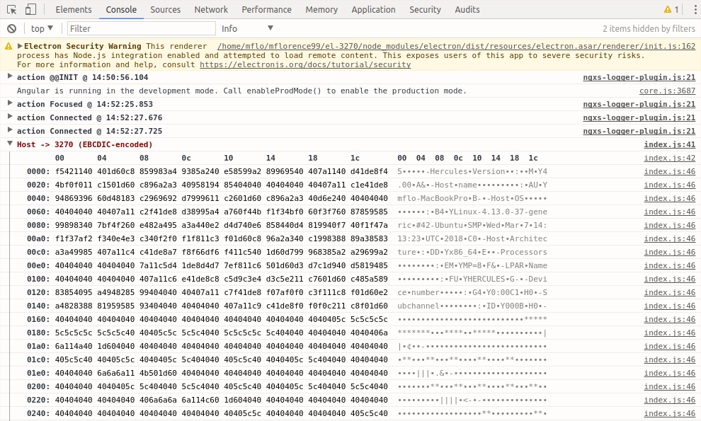
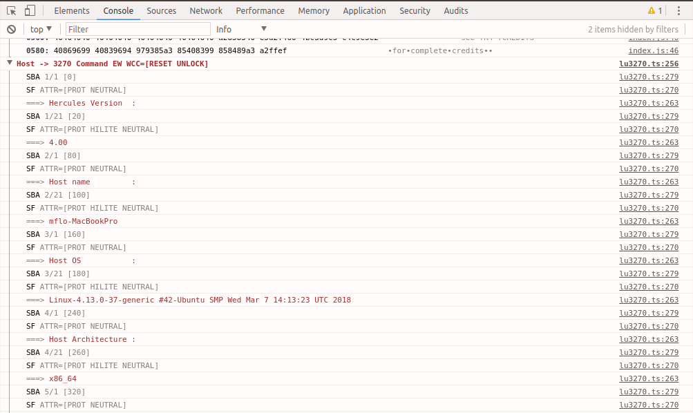

# EL-3270

EL-3270 is an [IBM 3270](https://en.wikipedia.org/wiki/IBM_3270) terminal emulator for the modern age. Why in earth is one needed, almost 50 years after the devices were first introduced in 1971? Of course, there is no need at all, I just did this for fun, as a voyage through computer archaeology. I don't expect anyone will ever use it as an actual emulator but I hope it showcases some programming techniques of current interest and illustrates how these historically important devices worked.

> EL-3270 is substantially complete, only missing support for the `PT` order. It is in minor flux until then.

<!-- toc -->

- [Technology Stack](#technology-stack)
  * [The MVS 3.8j Tur(n)key 4- System](#the-mvs-38j-turnkey-4--system)
- [References](#references)
- [How to Run in Development Mode](#how-to-run-in-development-mode)
- [UI Tour](#ui-tour)
  * [Initial Configuration](#initial-configuration)
  * [Sample Screen](#sample-screen)
  * [Extended Keyboard](#extended-keyboard)
- [Debugging Information](#debugging-information)

<!-- tocstop -->

## Technology Stack

I wanted -- and certainly failed -- to present a wrapper interface and underlying code structure that tries to appear be as fresh and as elegant as the 3270's themselves did to earlier generations of programmers. I have relied heavily on one of the best tech stacks currently available:

* [Electron](https://electronjs.org/) to build a cross-platform desktop app with [TypeScript](http://www.typescriptlang.org/), HTML and CSS.
* [Angular](https://angular.io/docs) as a framework for SPAs.
* Thorsten Hans' [ngx-electron](https://github.com/ThorstenHans/ngx-electron) to expose Electron's API to Angular.
* [Angular Material](https://material.angular.io/) for UI components.
* [Font Awesome](https://fontawesome.com)'s awesome library of icons.
* The amazing [ngxs](https://ngxs.gitbooks.io/ngxs/) state management pattern.
* Geoff Zhu's [electron-capture](https://github.com/GeoffZhu/electron-capture) to simulate the 3270's print screen functionality.

In addition, I factored out some interesting code for use in other projects of mine:

* [el-lib](https://github.com/mflorence99/el-lib) a common library for my Electron projects.
* [tn3270](https://github.com/mflorence99/tn3270) a pure TypeScript implementation of the Telnet 3270 handshake for Node.js.

### The MVS 3.8j Tur(n)key 4- System

Finally, I need to call out Jürgen Winkelmann's [labor of love](http://wotho.ethz.ch/tk4-/), the project that got me interested in EL-3270 from the start. TK4 simulates a full implementation of MVS running on an IBM 370/165, a top-of-the-line configuration in the 70s. The 370/165 sported a gigantic 16MB of memory -- you read that right, 16MB not 16GB -- yet it barely registers on `top` on my MacBook Pro.

> I highly recommend the [moshix](https://www.youtube.com/channel/UCR1ajTWGiUtiAv8X-hpBY7w) YouTube channel for many in-depth discussions on mainframe archaeology.

A couple of interesting factoids I learned from moshix -- aside from his encyclopedic and invaluable knowledge of the important bits -- are:

* IBM used the term 'storage' instead of 'memory' because the sales people were concerned that if computers had 'memory' they might also be thought to 'forget.'
* MVS 3.8 is alone among the IBM operating system products to be open source, because it was developed specially for the US Government and thus funded by taxpayer dollars.

## References

After all these years, the original 3270 documentation is out of print. Some second-hand manuals are available through Amazon but at exorbitant prices.

* The [Reference Booklet](https://www.amazon.com/Information-Display-System-Reference-GX20-1878-4/dp/B003MADXUY/ref=sr_1_9?ie=UTF8&qid=1522950757&sr=8-9&keywords=IBM+3270) would've been very useful but it is out of print.
* I might've leaned a lot from this [IBM PC 3270 Emulation](https://www.amazon.com/PC-Mainframe-Connection-3270-Emulation/dp/B00DD6XJ7O/ref=sr_1_14?ie=UTF8&qid=1522950847&sr=8-14&keywords=IBM+3270) book but I balked at its $105 cost.

In the end, there was one resource I counted heavily on. It is hard to read but dead-on accurate. Hats off to the original writers who did an amazing job.

* [3270 Data Stream Programmer's Reference](http://publibz.boulder.ibm.com/cgi-bin/bookmgr_OS390/BOOKS/CN7P4000/CCONTENTS?DT=19920626112004)

Finally, these two documents are great introductions, but you can't count on them to tell the whole story.

* [3270 Data Stream Programming](http://www.tommysprinkle.com/mvs/P3270/start.htm)
* [3270 Programming Overview](http://www.prycroft6.com.au/misc/3270.html)

## How to Run in Development Mode

> This is the only way for now, until I package EL-3270 properly as a standalone desktop app -- which is after all the point of Electron.

First, unless you have access to a host that supports 3270 connections, you should run TK4. All the screenshots here are taken using TK4. On my development system:

```
cd /mvs38
./mvs
```

One time only, you'll need to grab the code:

```
git clone https://github.com/mflorence99/el-3270.git
cd el-3270
npm install
```

Next, in another terminal session start the dev server for the Angular client. This way, hot reload of the client is supported.

```
npm run serve
```

Finally, in yet another session, start the Electron app itself:

```
npm run electron
```

## UI Tour

Self-explanatory meta functions are triggered by the icons on the top row: connect, disconnect, show extended keyboard (more below), configuration and help.

As you change the size of the window, the 3270 font scales to best fit the available space.

### Initial Configuration



### Sample Screen



### Extended Keyboard

For 3270 functionality not available on modern keyboards.

> I made no attempt to differentiate between ENTER and RETURN, which the real 3270 does. It is just too natural now for them to mean the same thing.



## Debugging Information

Because the whole purpose of EL-3270 is to further the understanding of the old devices, the V8 console contains copious debugging information, much of which is dedicated to dumping and decoding the 3270 data stream.




